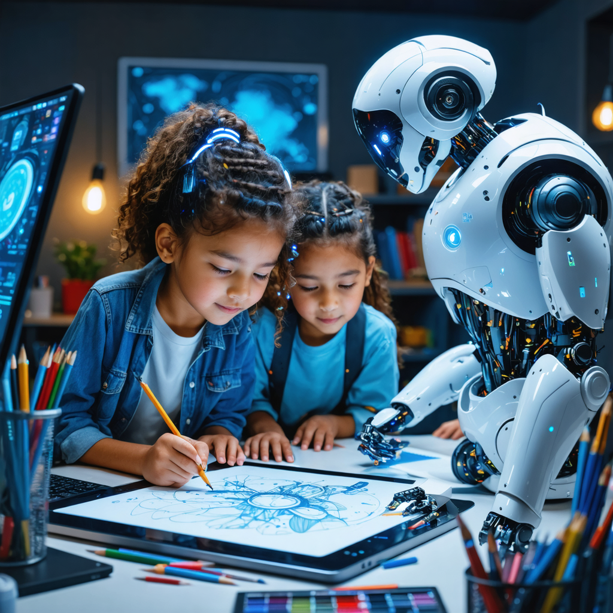

# FAZAA - Art Platform Documentation

## Table of Contents
1. [Executive Summary](#executive-summary)
2. [Goals and Objectives](#goals-and-objectives)
3. [History and Background](#history-and-background)
4. [Core Values](#core-values)
5. [Platform Features](#platform-features)
6. [Competition Structure](#competition-structure)
7. [User Roles and Dashboards](#user-roles-and-dashboards)
8. [Technical Implementation](#technical-implementation)
9. [Future Development](#future-development)

---

## Executive Summary

FAZAA - Art is an innovative AI-powered art competition platform designed to empower students in exploring digital creativity through interactive challenges and community-driven engagement. The platform provides students with access to advanced AI tools for generating artwork and poetry, allowing them to participate in structured competitions across multiple levels from classroom to global stages.

The application combines artistic expression with cutting-edge technology, creating an educational environment that fosters both creative and technical skills development. FAZAA - Art serves as a vibrant community where students can showcase their talent, receive peer feedback, and gain recognition for their artistic achievements.

---

## Goals and Objectives

The primary goals of FAZAA - Art are:

1. **Empower Student Creativity**: Provide students with powerful AI tools to explore and express their creativity in new and innovative ways.

2. **Foster Artistic Community**: Create a platform where students can share their work, appreciate others' creations, and engage in constructive feedback.

3. **Structure Creative Competitions**: Implement a multi-tiered competition system from classroom to global levels that motivates participation and excellence.

4. **Introduce AI Technology in Education**: Help students become familiar with AI capabilities in artistic contexts, preparing them for future technological landscapes.

5. **Promote Cross-Cultural Exchange**: Connect students from different schools, countries, and backgrounds through shared creative experiences.

6. **Develop Technical Skills**: Enable students to learn digital tools, prompt engineering, and AI collaboration while creating art.

---

## History and Background

FAZAA - Art originated as an International Baccalaureate CAS (Creativity, Activity, Service) project with the ambitious goal of creating a vibrant art community. The platform evolved to leverage artificial intelligence to foster creative competition among students.

The initiative was designed to encourage students to explore their creativity beyond conventional boundaries. By using AI-generated prompts, FAZAA - Art challenges participants to craft poems and create art pieces based on carefully selected themes, pushing the boundaries of conventional thinking and inspiring participants to think outside the box.

Through this process, the platform not only nurtures artistic expression but also promotes the development of thought-provoking, imaginative content that combines traditional artistic sensibilities with modern technological capabilities.

---

## Core Values

FAZAA - Art is built upon three fundamental values:

### Creativity
We foster an environment where creative thinking is celebrated and encouraged, allowing students to express their unique perspectives and artistic visions.

### Collaboration
We believe in the power of shared experiences and learning from each other through friendly competition and peer feedback. The platform creates opportunities for students to inspire one another and grow through community engagement.

### Innovation
We embrace new technologies as tools for expanding artistic possibilities, helping students explore the frontier of AI-assisted creativity. The platform introduces students to cutting-edge AI models for both visual art and poetry generation.

---

## Platform Features

FAZAA - Art offers a comprehensive set of features designed to support student creativity and artistic competition:

### 1. AI Art Generation
- Integration with state-of-the-art image generation models (OpenAI DALL-E and Hugging Face Stable Diffusion)
- User-friendly interface for creating AI-generated artwork from text prompts
- Support for various artistic styles and themes
- Ability to save and submit generated artwork to competitions

### 2. AI Poetry Generation
- Advanced language models for poetry creation (OpenAI GPT and Hugging Face Mistral)
- Options for different poetic styles (haiku, sonnet, free verse, etc.)
- Customizable parameters for tone, theme, and structure
- Editing capabilities for refining AI-generated content

### 3. Comprehensive Competition System
- Multi-stage competition structure (class, school, country, global)
- Peer voting system for democratic selection of winners
- Teacher validation of student submissions
- Winner recognition at each stage of the competition

### 4. User Management
- Role-based access control (students, teachers, administrators)
- School and class organization system
- Student portfolio management
- Secure authentication with password recovery

### 5. Admin Dashboard
- Comprehensive management of users, schools, classes, and events
- Submission validation and moderation tools
- Competition management and scheduling
- Partner and sponsor integration

### 6. Multilingual Support
- Full translation support for English and Arabic
- Easily expandable language framework
- Culturally responsive interface elements

---

## Competition Structure

FAZAA - Art implements a progressive four-tier competition structure:

### 1. Class Stage
Students compete against classmates, with peer voting determining the top 3 submissions that advance to the next stage. This initial stage encourages participation and builds confidence in a familiar environment.

### 2. School Stage
Class winners compete against other classes in their grade level, with the top 3 submissions from each school advancing to the national competition. This stage broadens students' exposure to diverse artistic approaches within their school.

### 3. Country Stage
School winners compete nationally, with a panel of educators and artists selecting the top submissions to advance to the global stage. This level provides visibility and recognition beyond the immediate school community.

### 4. Global Stage
The best submissions from around the world compete for international recognition, with winners receiving special recognition and prizes. This prestigious level connects students to a global community of peers and potential opportunities.

---

## User Roles and Dashboards

### Student Role
- Access to AI creation tools for art and poetry
- Ability to submit work to open competitions
- Participation in peer voting processes
- Personal portfolio of submissions and achievements

### Teacher Role
- Management of class groups and student accounts
- Validation of student submissions
- Monitoring of class participation and results
- Facilitation of school-level competitions

### Administrator Role
- Complete system management
- Creation and scheduling of competitions
- User management across all schools
- Report generation and platform oversight
- Partner and sponsor relationship management

---

## Technical Implementation

FAZAA - Art is built using a modern, scalable technology stack:

### Frontend
- React.js with TypeScript for a robust, type-safe UI
- Tailwind CSS for responsive design
- Shadcn/ui component library for consistent interface elements
- TanStack Query for efficient data fetching and state management

### Backend
- Express.js server for API endpoints
- PostgreSQL database for data persistence
- Drizzle ORM for database operations and migrations
- RESTful API design for client-server communication

### AI Integration
- OpenAI API integration for high-quality art and poetry generation
- Hugging Face API as an alternative open-source AI solution
- Fallback mechanisms for service continuity during API outages

### Security
- JWT-based authentication system
- Secure password management with hashing
- CAPTCHA protection against automated attacks
- Role-based access control for protected resources

---

## Future Development

FAZAA - Art has a roadmap for continued enhancement:

1. **Enhanced AI Tools**: Integration of more specialized AI models for different artistic styles

2. **Mobile Application**: Development of native mobile apps for iOS and Android

3. **Advanced Analytics**: Implementation of insights and statistics for students and educators

4. **Expanded Language Support**: Addition of more languages beyond English and Arabic

5. **Virtual Exhibitions**: Creation of virtual galleries for showcasing student work

6. **Integration with Educational Platforms**: Connecting with learning management systems used in schools

7. **Mentorship Program**: Connecting students with professional artists and writers for guidance

---

*This documentation was generated on April 1, 2025.*

*FAZAA - Art: Empowering student creativity through AI-assisted artistic expression and friendly competition.*